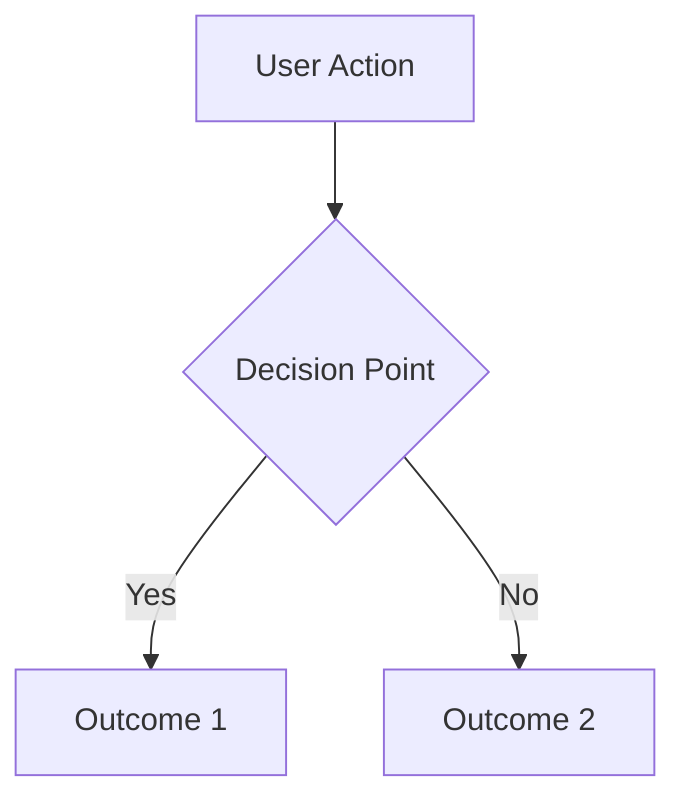

# Story Specification: [Story Name]

**Date**: YYYY-MM-DD
**Status**: Draft | Ready for Review | In Review | Approved | Complete
**Type**: SPEC
**Review Status**: ⏳ Pending | 🔄 In Progress | ✅ Approved
**Links**:
  - Plan: [./plan.md](./plan.md)
  - Overview: [./overview.md](./overview.md)
  - Story: `.ctx/stories/[YYYYMMDD-story-name]/`

## Priority Legend
🔴 **Critical** - Must have / Blocks progress
🟡 **Important** - Should have / Affects quality
🟢 **Optional** - Nice to have / Can use defaults

## Executive Summary
*One paragraph explaining WHY this story matters and WHAT it does for users*

## 📊 Progress Status
| Stage  | Requirements  | Design    | Implementation | Testing   |
| ------ | ------------- | --------- | -------------- | --------- |
| Status | 🔄 In Progress | ⏳ Pending | ⏳ Pending      | ⏳ Pending |

---

## Story Overview

### Problem Statement
*What problem are we solving? Why does it matter?*

### Success Metrics
*How will we know if this story is successful?*
- [ ] Metric 1: [e.g., User can complete task in < 3 clicks]
- [ ] Metric 2: [e.g., 80% of users understand story without documentation]

---

## 🎯 User Scenarios & Testing

### Primary User Story
As a [user type], I want to [action] so that [benefit].

### Acceptance Scenarios
*Use Given/When/Then format*
1. **Given** [context], **When** [action], **Then** [expected outcome]
2. **Given** [context], **When** [action], **Then** [expected outcome]

### Edge Cases & Error Handling
- What happens when [edge case]?
- How does system handle [error scenario]?
- What if [resource limitation]?

### Out of Scope
*Explicitly list what this story will NOT do*
- Will not support [X]
- Does not include [Y]

---

## 📋 Functional Requirements

### Core Requirements
*Each must be testable and unambiguous*
- 🔴 **FR-001**: System MUST [specific behavior]
- 🔴 **FR-002**: Users MUST be able to [specific action]
- 🔴 **FR-003**: System MUST [constraint or rule]

### Optional/Future Requirements
*Nice-to-have storys for later phases*
- 🟢 **FR-OPT-001**: System MAY [optional feature]

### Non-Functional Requirements
*Performance, security, usability constraints*
- 🟡 **NFR-001**: [Performance requirement]
- 🟡 **NFR-002**: [Security requirement]

---

## 🔄 User Workflows

### Primary Flow

### Alternative Flows
*Describe variations from the primary flow*

---

## 🔍 Clarifications & Decisions
*All clarifications have been resolved through the requirements gathering phase*

### Resolved Clarifications
| #   | Question         | Resolution              | Impact                     |
| --- | ---------------- | ----------------------- | -------------------------- |
| 001 | [Question asked] | [Clear answer received] | [How this shaped the spec] |
| 002 | [Question asked] | [Clear answer received] | [How this shaped the spec] |

### Key Decisions Made
| Decision   | Rationale         | Based On                |
| ---------- | ----------------- | ----------------------- |
| [Decision] | [Why this choice] | [User clarification #X] |
| [Decision] | [Why this choice] | [User clarification #Y] |

### Clarification Summary
✅ **All critical clarifications resolved**
✅ **No ambiguities remain**
✅ **Spec ready for implementation**

---

## ✅ Review Checklist

### Completeness
- [ ] All user scenarios have clear acceptance criteria
- [ ] Requirements are numbered and traceable
- [ ] Success metrics are measurable
- [ ] Edge cases are documented
- [ ] No [NEEDS CLARIFICATION] markers remain

### Clarification Completeness
- [ ] All critical questions were asked and answered
- [ ] Each clarification has clear resolution documented
- [ ] No vague or ambiguous answers were accepted
- [ ] Clarifications are numbered and trackable (#001, #002, etc.)
- [ ] Impact of each clarification on requirements is documented
- [ ] Decision rationale clearly linked to clarifications

### Quality
- [ ] No implementation details (languages, frameworks, APIs)
- [ ] Written for non-technical stakeholders
- [ ] Each requirement is testable
- [ ] Scope is clearly bounded
- [ ] Dependencies identified

---

## 📝 Decision Log
*Record key decisions made during spec development*

| Date       | Decision                | Rationale               | Made By |
| ---------- | ----------------------- | ----------------------- | ------- |
| YYYY-MM-DD | Chose approach X over Y | Because of constraint Z | Person  |

## 📋 Next Steps

### To Implementation
- ✅ Ensure all 🔴 Critical requirements are resolved
- ✅ Clarifications documented in Decision Log
- ✅ Success metrics defined and measurable
- 🛡️ **Human Review Gate**: Must receive explicit approval before proceeding
- ➡️ **Proceed to**: [Implementation Plan](./plan.md) (only after approval)

### Checklist Before Implementation
- [ ] All critical clarifications resolved
- [ ] Requirements numbered and traceable
- [ ] Success metrics measurable
- [ ] Edge cases documented
- [ ] No [NEEDS CLARIFICATION] markers remain
- [ ] **Human review completed and approved**
