# Feature Development Workflow
*From idea to implementation - A systematic approach*

## 🎯 Overview

This workflow ensures features are properly specified, planned, and implemented with clear separation of concerns:

```mermaid
graph LR
    A[💡 Idea] --> B[📋 Spec]
    B --> C[📐 Plan]
    C --> D[💻 Implement]
    D --> E[✅ Validate]

    B -.->|WHAT & WHY| B1[Business Requirements]
    C -.->|HOW| C1[Technical Design]
    D -.->|CODE| D1[Implementation]
```



---

## 📊 Phase Comparison

| Phase     | Focus      | Output                | Audience     | Command       |
| --------- | ---------- | --------------------- | ------------ | ------------- |
| **Spec**  | WHAT & WHY | Business requirements | Stakeholders | `/spec`       |
| **Plan**  | HOW        | Technical design      | Developers   | `/plan`       |
| **Build** | CODE       | Working software      | Users        | manual coding |

---

## 🔄 Complete Workflow

### Phase 1: Specification (`/spec`)

**Purpose**: Transform vague ideas into clear, testable requirements

```bash
# Start with an idea
/spec "Build a photo album organizer where users can group photos by date"

# AI will:
1. Analyze the requirement
2. Search codebase for context
3. Generate clarification questions
4. Create comprehensive spec

# Output: .spec/specs/20250125-photo-album/spec.md
```

**Key Activities**:
- 🔍 Identify ambiguities (mark as [NEEDS CLARIFICATION #XXX])
- ❓ Clarify with stakeholder
  - Present by priority (🔴 → 🟡 → 🟢)
  - Track resolutions in clarification table
  - Iterate until all critical items resolved
- 📝 Document requirements
- ✅ Define acceptance criteria

**Deliverables**:
- Feature specification document
- Acceptance test scenarios
- Success metrics
- Scope boundaries

### Phase 2: Planning (`/plan`)

**Purpose**: Create implementation-ready technical design

```bash
# Use the approved spec
/plan @.spec/specs/20250125-photo-album/spec.md

# AI will:
1. Analyze technical requirements
2. Design architecture
3. Define interfaces
4. Plan implementation steps

# Output: .spec/specs/20250125-photo-album/plan.md
```

**Key Activities**:
- 🏗️ Design architecture
- 🔌 Define interfaces
- 📦 Plan components
- 🧪 Design test strategy

**Deliverables**:
- Technical design document
- API specifications
- Database schemas
- Implementation roadmap

### Phase 3: Implementation

**Purpose**: Build the solution following the plan

```bash
# Follow the plan step by step
1. Review: @.spec/specs/20250125-photo-album/plan.md
2. Implement each component
3. Write tests
4. Integrate
```

**Key Activities**:
- 💻 Write code
- 🧪 Write tests
- 🔧 Debug issues
- 📚 Update documentation

**Deliverables**:
- Working code
- Test suite
- Documentation
- Deployment artifacts

---

## 🚦 Decision Gates

### Gate 1: Spec → Plan
**Requirements before proceeding**:
- [ ] All [NEEDS CLARIFICATION] resolved
  - [ ] 🔴 Critical clarifications: 100% resolved
  - [ ] 🟡 Important clarifications: 100% resolved
  - [ ] 🟢 Optional clarifications: Defaults documented
- [ ] Clarification tracking table completed
- [ ] Stakeholder approval obtained
- [ ] Success criteria defined
- [ ] Scope clearly bounded

### Gate 2: Plan → Build
**Requirements before proceeding**:
- [ ] Technical design reviewed
- [ ] Dependencies identified
- [ ] Risk mitigation planned
- [ ] Resource allocation confirmed

### Gate 3: Build → Deploy
**Requirements before proceeding**:
- [ ] All tests passing
- [ ] Code review completed
- [ ] Documentation updated
- [ ] Acceptance criteria met

---

## 🎭 Role Responsibilities

### During Specification Phase

| Role             | Human                                 | AI                          |
| ---------------- | ------------------------------------- | --------------------------- |
| **Lead**         | Business decisions                    | Question generation         |
| **Activities**   | Answer clarifications, Define success | Search codebase, Draft spec |
| **Output Owner** | Approves spec                         | Writes spec                 |

### During Planning Phase

| Role             | Human                                | AI                                      |
| ---------------- | ------------------------------------ | --------------------------------------- |
| **Lead**         | Technical decisions                  | Design generation                       |
| **Activities**   | Choose technologies, Set constraints | Propose architecture, Define interfaces |
| **Output Owner** | Approves plan                        | Writes plan                             |

### During Implementation Phase

| Role             | Human                      | AI                      |
| ---------------- | -------------------------- | ----------------------- |
| **Lead**         | Quality standards          | Code generation         |
| **Activities**   | Review code, Test manually | Write code, Write tests |
| **Output Owner** | Accepts implementation     | Produces implementation |

---

## 📁 File Organization

```
project/
├── .spec/                    # Specifications & Plans
│   ├── specs/              # Feature stories (WHAT, WHY, HOW)
│   │   ├── 20250125-photo-album/
│   │   │   ├── spec.md       # Business requirements (WHAT & WHY)
│   │   │   ├── plan.md       # Technical design (HOW)
│   │   │   ├── notes.md      # Discussion notes (optional)
│   │   │   └── assets/       # Diagrams, mockups
│   │   └── 20250126-dark-mode/
│   │       ├── spec.md
│   │       └── plan.md
│   ├── templates/             # Document templates
│   │   ├── SPEC_TEMPLATE.md
│   │   ├── SPEC_QUESTIONS.md
│   │   ├── PLAN_TEMPLATE.md
│   │   └── PLAN_QUESTIONS.md
│   └── DEVELOPMENT_WORKFLOW.md
│
├── .claude/                   # AI command definitions
│   └── commands/
│       ├── spec.md           # Specification command
│       └── plan.md           # Planning command
│
└── src/                      # Implementation (CODE)
    └── [actual code]
```

---

## 🔄 Iteration & Feedback

### Continuous Improvement Loop


### Feedback Integration Points

1. **Post-Spec Review**
   - Were all ambiguities caught?
   - Did requirements change during planning?
   - Update SPEC_QUESTIONS.md with new patterns
   - **Clarification Pattern Analysis**:
     - Which clarifications were most critical?
     - What types of questions recur frequently?
     - Add common patterns to SPEC_QUESTIONS.md
     - Update priority guidelines based on impact

2. **Post-Plan Review**
   - Was design implementable?
   - Did we miss technical constraints?
   - Update planning templates

3. **Post-Implementation Review**
   - Did plan match reality?
   - What wasn't specified clearly?
   - Update both spec and plan templates

---

## 🎯 Best Practices

### For Specifications
✅ **DO**:
- Focus on user value
- Define measurable success
- Document edge cases
- Set clear boundaries

❌ **DON'T**:
- Include technical details
- Assume implementation
- Leave ambiguities
- Skip validation scenarios

### For Planning
✅ **DO**:
- Follow existing patterns
- Design for testability
- Consider scalability
- Document decisions

❌ **DON'T**:
- Over-engineer
- Ignore constraints
- Skip error handling
- Forget migrations

### For Implementation
✅ **DO**:
- Follow the plan
- Write tests first
- Refactor continuously
- Document changes

❌ **DON'T**:
- Deviate without updating plan
- Skip tests
- Ignore code standards
- Leave TODOs untracked

---

## 🚀 Quick Start Examples

### Example 1: Simple Feature
```bash
# 1. Specify
/spec "Add dark mode toggle to settings"
# Output: .spec/specs/20250125-dark-mode/spec.md

# 2. Plan (after spec approval)
/plan @.spec/specs/20250125-dark-mode/spec.md
# Output: .spec/specs/20250125-dark-mode/plan.md

# 3. Implement
# Follow plan step-by-step
```

### Example 2: Complex Feature
```bash
# 1. Specify with context
/spec "Multi-tenant authentication system with SSO support"
# Output: .spec/specs/20250125-auth-system/spec.md

# 2. Iterative clarification
# AI presents clarifications:
# 🔴 Critical (3 items)
#   - [#001] Tenant data isolation model?
#   - [#002] Supported SSO providers?
#   - [#003] Session management approach?
# 🟡 Important (2 items)
#   - [#004] Password complexity requirements?
#   - [#005] MFA support needed?
# 🟢 Optional (1 item)
#   - [#006] Custom branding per tenant?

# User provides answers, AI updates spec

# 3. Phased planning
/plan @.spec/specs/20250125-auth-system/spec.md --phase=1
# Output: .spec/specs/20250125-auth-system/plan.md

# 4. Incremental implementation
# Build MVP first, then enhance
```

---

## 📊 Metrics & Success

### Specification Quality Metrics
- Clarification rounds needed: Target < 2
- Ambiguities found in planning: Target 0
- Spec changes during implementation: Target < 10%
- NEEDS CLARIFICATION tracking:
  - 🔴 Critical resolution rate: Target 100% before proceeding
  - 🟡 Important resolution rate: Target > 90%
  - Total clarifications identified: Track for patterns
  - Average resolution time: Target < 24 hours

### Planning Quality Metrics
- Plan changes during implementation: Target < 20%
- Unplanned work discovered: Target < 15%
- Technical debt introduced: Target minimal

### Implementation Quality Metrics
- Tests coverage: Target > 80%
- Acceptance criteria met: Target 100%
- Rework required: Target < 10%

---

## 🔗 Related Documents
- [Spec Template](.spec/templates/SPEC_TEMPLATE.md)
- [Spec Questions](.spec/templates/SPEC_QUESTIONS.md)
- [Collaboration Workflow](.spec/COLLABORATION_WORKFLOW.md)
- [Plan Command](.claude/commands/plan.md)
- [Spec Command](.claude/commands/spec.md)