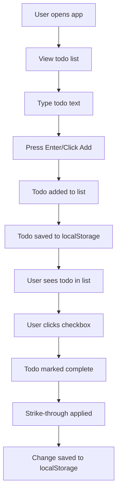
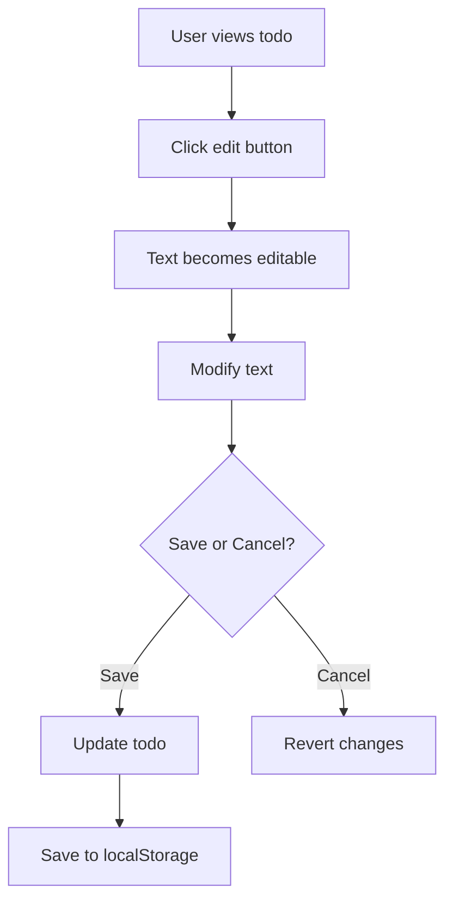
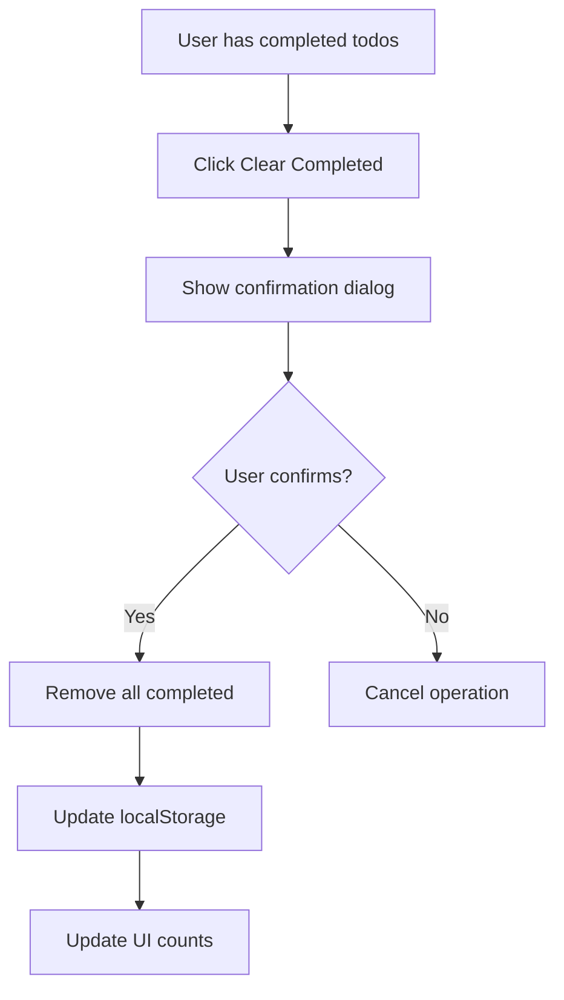

# Feature Specification: Todo List Application

**Created**: 2025-09-25
**Status**: Draft
**Input**: Create a simple todo list with client side only (use local storage)

## Executive Summary
This todo list application provides users with a simple, reliable way to manage their daily tasks without requiring account creation or internet connectivity. By leveraging browser local storage, users can create, edit, complete, and delete todos with the confidence that their data persists across browser sessions. The application emphasizes simplicity and usability while maintaining a modern, professional interface built with React and shadcn/ui components.

---

## Feature Overview

### Problem Statement
Users need a quick, accessible way to track daily tasks without the overhead of creating accounts, managing cloud synchronization, or dealing with complex project management tools. Many existing solutions are either too simple (lacking persistence) or too complex (requiring authentication and setup). This creates friction for users who simply want to jot down and track their todos.

### Success Metrics
- [ ] Metric 1: User can create a new todo in less than 3 seconds
- [ ] Metric 2: Todos persist correctly across browser sessions without data loss
- [ ] Metric 3: Interface is immediately understandable without documentation
- [ ] Metric 4: Application loads and is interactive in under 2 seconds
- [ ] Metric 5: Zero data loss during normal usage patterns

---

## 🎯 User Scenarios & Testing

### Primary User Story
As a busy individual, I want to quickly capture and manage my daily tasks so that I can stay organized without the overhead of complex task management systems.

### Acceptance Scenarios

1. **Given** the user opens the application for the first time, **When** they view the interface, **Then** they see an empty todo list with a clear input field to add their first todo

2. **Given** the user types a todo text, **When** they press Enter or click the Add button, **Then** the todo appears in the list immediately and is saved to local storage

3. **Given** the user has existing todos, **When** they click on a todo's checkbox, **Then** the todo is marked as completed with a strike-through effect

4. **Given** the user has a todo item, **When** they click the edit button, **Then** they can modify the todo text inline

5. **Given** the user has a todo item, **When** they click the delete button, **Then** the todo is removed from the list and local storage

6. **Given** the user has completed todos, **When** they click "Clear completed", **Then** they see a confirmation dialog before bulk deletion

7. **Given** the user has todos saved, **When** they close and reopen the browser, **Then** all todos appear exactly as they left them

8. **Given** the user is viewing the todo list, **When** they look at the statistics, **Then** they see accurate counts of active and completed todos

### Edge Cases & Error Handling
- What happens when localStorage is full? → Display error message, prevent data corruption
- What happens with empty todo text? → Prevent submission, show validation message
- What happens with extremely long todo text? → Truncate display with ellipsis, show full text on hover/edit
- What happens when localStorage is disabled? → Show warning banner, app works in session-only mode
- What happens during concurrent edits? → Last edit wins, auto-save prevents conflicts
- What happens with special characters in todos? → Properly escape and display all Unicode characters

### Out of Scope
- Will not support multiple todo lists or projects
- Does not include user authentication or accounts
- Will not sync across devices or browsers
- Does not support due dates, priorities, or tags
- Will not include keyboard shortcuts (initial version)
- Does not provide data export/import functionality
- Will not support drag-and-drop reordering
- Does not include recurring todos or templates

---

## 📋 Functional Requirements

### Core Requirements

- **FR-001**: System MUST provide an input field for creating new todos
- **FR-002**: System MUST display all todos in a single, scrollable list
- **FR-003**: System MUST allow users to mark todos as complete/incomplete via checkbox
- **FR-004**: System MUST visually distinguish completed todos with strike-through styling
- **FR-005**: System MUST allow inline editing of todo text
- **FR-006**: System MUST provide a delete button for each individual todo
- **FR-007**: System MUST automatically save all changes to browser localStorage
- **FR-008**: System MUST load todos from localStorage on application start
- **FR-009**: System MUST display count of active todos
- **FR-010**: System MUST display count of completed todos
- **FR-011**: System MUST provide "Clear completed" bulk action with confirmation
- **FR-012**: System MUST prevent submission of empty todos
- **FR-013**: System MUST generate unique identifiers for each todo
- **FR-014**: System MUST maintain todo creation order in the list
- **FR-015**: System MUST handle localStorage errors gracefully with user feedback

### Optional/Future Requirements

- **FR-OPT-001**: System MAY support keyboard shortcuts for common actions
- **FR-OPT-002**: System MAY provide undo functionality for deletions
- **FR-OPT-003**: System MAY support todo text search/filtering
- **FR-OPT-004**: System MAY provide data export to JSON
- **FR-OPT-005**: System MAY support drag-and-drop reordering
- **FR-OPT-006**: System MAY support categories or tags
- **FR-OPT-007**: System MAY provide completion statistics over time

### Non-Functional Requirements

- **NFR-001**: Application MUST load in under 2 seconds on 3G connection
- **NFR-002**: UI MUST be responsive across mobile, tablet, and desktop viewports
- **NFR-003**: Application MUST follow WCAG 2.1 Level AA accessibility guidelines
- **NFR-004**: localStorage operations MUST not block UI interactions
- **NFR-005**: Application MUST support latest 2 versions of Chrome, Firefox, Safari, Edge
- **NFR-006**: Todo text MUST support Unicode characters and emojis
- **NFR-007**: Application MUST handle up to 1000 todos without performance degradation
- **NFR-008**: UI interactions MUST provide visual feedback within 100ms

---

## 🔧 Key Entities & Concepts

### Domain Model
```
Todo:
  - id: unique identifier (UUID or timestamp-based)
  - text: the todo content (string, required, max 500 chars)
  - completed: completion status (boolean, default false)
  - createdAt: timestamp of creation (ISO 8601 string)
  - updatedAt: timestamp of last modification (ISO 8601 string)

TodoList:
  - todos: array of Todo items
  - activeCount: computed count of incomplete todos
  - completedCount: computed count of completed todos
  - lastModified: timestamp of last list change

LocalStorageSchema:
  - key: "todos" (constant)
  - value: serialized TodoList object (JSON string)
  - version: schema version for future migrations
```

### Business Rules
- Rule 1: Todo text cannot be empty or only whitespace
- Rule 2: Todo IDs must be unique within the list
- Rule 3: Completed todos remain in the list until explicitly deleted
- Rule 4: Todo order is maintained based on creation time
- Rule 5: Editing a todo updates its updatedAt timestamp
- Rule 6: Bulk delete only affects completed todos
- Rule 7: localStorage key must be namespaced to avoid conflicts
- Rule 8: Data integrity must be maintained during save operations

---

## 🔄 User Workflows

### Primary Flow - Create and Complete Todo


### Alternative Flow - Edit Existing Todo


### Alternative Flow - Bulk Clear Completed


---

## 🔍 Clarifications Needed

### Tracking Summary
| Priority | Count | Status |
|----------|-------|--------|
| 🔴 Critical | 0 | All resolved |
| 🟡 Important | 0 | All resolved |
| 🟢 Optional | 0 | Using defaults |
| **Total** | **0** | **All resolved** |

*All initial clarifications have been resolved through user feedback. The specification is complete and ready for implementation.*

---

## ✅ Review Checklist

### Completeness
- [x] All user scenarios have clear acceptance criteria
- [x] Requirements are numbered and traceable
- [x] Success metrics are measurable
- [x] Edge cases are documented
- [x] No [NEEDS CLARIFICATION] markers remain

### Clarification Completeness
- [x] All critical clarifications resolved
- [x] Each clarification has clear resolution documented
- [x] No implicit assumptions remain undocumented
- [x] Impact of each clarification on requirements is documented
- [x] Default assumptions are reasonable and documented

### Quality
- [x] No implementation details (specific to business logic)
- [x] Written for non-technical stakeholders
- [x] Each requirement is testable
- [x] Scope is clearly bounded
- [x] Dependencies identified

---

## 📝 Decision Log

| Date | Decision | Rationale | Made By |
|------|----------|-----------|---------|
| 2025-09-25 | Use React + Vite stack | Modern tooling, component-based architecture, fast development | User |
| 2025-09-25 | Start with text-only todos | Simplicity first, can extend later | User |
| 2025-09-25 | Auto-save on every change | Better UX, no manual save needed | Assistant |
| 2025-09-25 | Single flat list structure | Reduces complexity for initial version | Assistant |
| 2025-09-25 | Use shadcn/ui components | Consistent, accessible, modern UI | User |
| 2025-09-25 | Strike-through for completed | Visual clarity without hiding data | Assistant |

---

## 📚 References
- Overview: [overview.md](./overview.md)
- Implementation plan: [plan-main.md](./plan-main.md)
- React Documentation: https://react.dev
- Vite Documentation: https://vitejs.dev
- shadcn/ui Documentation: https://ui.shadcn.com