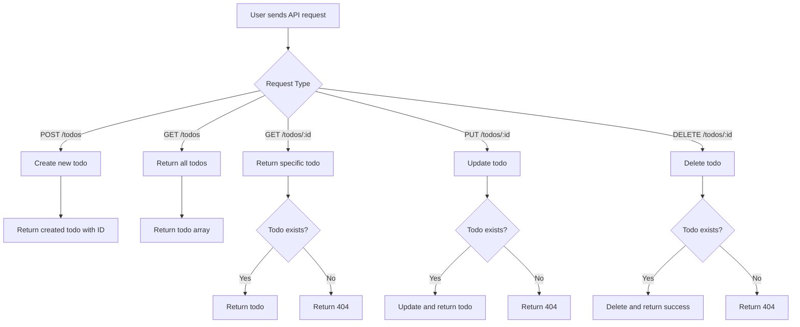

# Feature Specification: Simple NestJS Todo Server

**Created**: 2025-09-26
**Status**: Approved
**Input**: "I just want to add a simple nestjs server to save todo list in sqlite"

## Executive Summary
A lightweight, single-user NestJS server providing a REST API for managing personal todo items with in-memory SQLite storage. This server enables basic Create, Read, Update, and Delete operations for todo items consisting of a title and completion status, designed for personal productivity tracking without authentication overhead.

---

## Feature Overview

### Problem Statement
The user needs a simple backend service to manage personal todo items through a REST API. Currently, there's no backend infrastructure in the monorepo to handle data operations, making it impossible to persist or manage todo items programmatically. This server will provide the essential backend functionality for todo management.

### Success Metrics
- [ ] Metric 1: Server starts successfully and accepts HTTP requests
- [ ] Metric 2: All CRUD operations complete within 100ms
- [ ] Metric 3: Zero authentication friction (immediate access)
- [ ] Metric 4: Todo items can be created, retrieved, updated, and deleted reliably

---

## 🎯 User Scenarios & Testing

### Primary User Story
As a solo developer, I want to manage my todo items through a REST API so that I can track my tasks programmatically without authentication complexity.

### Acceptance Scenarios
1. **Given** the server is running, **When** I send a POST request with a todo title, **Then** a new todo is created with a unique ID and completed=false
2. **Given** todos exist in the system, **When** I send a GET request to /todos, **Then** I receive all todos as a JSON array
3. **Given** a todo exists with ID 1, **When** I send a GET request to /todos/1, **Then** I receive that specific todo's details
4. **Given** a todo exists, **When** I send a PUT request with updated data, **Then** the todo is modified accordingly
5. **Given** a todo exists, **When** I send a DELETE request with its ID, **Then** the todo is removed from the system
6. **Given** the server restarts, **When** I request all todos, **Then** I receive an empty list (in-memory storage)

### Edge Cases & Error Handling
- What happens when requesting a non-existent todo ID? → Return 404 Not Found
- How does system handle invalid request body? → Return 400 Bad Request with error message
- What if todo title is empty? → Return 400 Bad Request requiring title
- What happens on server restart? → All todos are lost (in-memory storage)
- What if updating non-existent todo? → Return 404 Not Found

### Out of Scope
- Will not support user authentication
- Does not include todo descriptions, priorities, or due dates
- Will not persist data between server restarts
- Does not support bulk operations
- Will not integrate with the existing React frontend
- No support for todo categories or tags
- No support for recurring todos
- No support for todo attachments or images

---

## 📋 Functional Requirements

### Core Requirements
- **FR-001**: System MUST provide a POST /todos endpoint that accepts {title: string} and creates a new todo
- **FR-002**: System MUST automatically generate unique IDs for each todo item
- **FR-003**: System MUST provide a GET /todos endpoint that returns all todos as JSON array
- **FR-004**: System MUST provide a GET /todos/:id endpoint that returns a specific todo
- **FR-005**: System MUST provide a PUT /todos/:id endpoint that updates todo title and/or completed status
- **FR-006**: System MUST provide a DELETE /todos/:id endpoint that removes a todo
- **FR-007**: Each todo MUST have exactly three properties: id (number), title (string), completed (boolean)
- **FR-008**: New todos MUST default to completed=false
- **FR-009**: System MUST use in-memory SQLite database (no file persistence)
- **FR-010**: System MUST return appropriate HTTP status codes (200, 201, 400, 404)

### Optional/Future Requirements
- **FR-OPT-001**: System MAY add support for filtering todos by completion status
- **FR-OPT-002**: System MAY add pagination for todo lists
- **FR-OPT-003**: System MAY add search functionality

### Non-Functional Requirements
- **NFR-001**: Server MUST run on port 3001 by default
- **NFR-002**: All API responses MUST be in JSON format
- **NFR-003**: Server MUST start within 5 seconds
- **NFR-004**: API responses MUST return within 100ms for typical operations
- **NFR-005**: Server MUST handle malformed JSON gracefully
- **NFR-006**: Server MUST log errors to console for debugging

---

## 🔄 User Workflows

### Primary Flow

### Alternative Flows
- Invalid request body → Return 400 Bad Request with validation error
- Empty title in POST/PUT → Return 400 Bad Request
- Server not running → Connection refused error

---

## 🔍 Clarifications & Decisions

### Resolved Clarifications
| # | Question | Resolution | Impact |
|---|----------|------------|--------|
| 001 | Todo Item Structure | Minimal (title, completed status only) | Simplified data model with just id, title, and completed fields |
| 002 | Todo Operations | Basic CRUD operations only | API limited to Create, Read (all/one), Update, Delete endpoints |
| 003 | Data Persistence | In-memory only (data lost on restart) | No SQLite file created, simpler setup, data resets on restart |
| 004 | API Integration with Frontend | Standalone server (no frontend integration) | Server runs independently, no CORS setup needed for React app |

### Key Decisions Made
| Decision | Rationale | Based On |
|----------|-----------|----------|
| Use minimal todo structure | Keep implementation simple for personal use | User clarification #001 |
| In-memory database only | Simplifies development and testing | User clarification #003 |
| No authentication | Personal use only, reduces complexity | User requirement "user is only me" |
| Port 3001 | Avoid conflict with React dev server on 3000 | Default convention |
| Basic error handling | Sufficient for personal use | Default for Important Questions |

### Clarification Summary
✅ **All critical clarifications resolved**
✅ **No ambiguities remain**
✅ **Spec ready for implementation**

---

## ✅ Review Checklist

### Completeness
- [x] All user scenarios have clear acceptance criteria
- [x] Requirements are numbered and traceable
- [x] Success metrics are measurable
- [x] Edge cases are documented
- [x] No [NEEDS CLARIFICATION] markers remain

### Clarification Completeness
- [x] All critical questions were asked and answered
- [x] Each clarification has clear resolution documented
- [x] No vague or ambiguous answers were accepted
- [x] Clarifications are numbered and trackable (#001, #002, etc.)
- [x] Impact of each clarification on requirements is documented
- [x] Decision rationale clearly linked to clarifications

### Quality
- [x] No implementation details (languages, frameworks, APIs)
- [x] Written for non-technical stakeholders
- [x] Each requirement is testable
- [x] Scope is clearly bounded
- [x] Dependencies identified

---

## 📝 Decision Log

| Date | Decision | Rationale | Made By |
|------|----------|-----------|---------|
| 2025-09-26 | Minimal todo structure | User wants simplicity | User |
| 2025-09-26 | In-memory SQLite | No persistence needed for testing | User |
| 2025-09-26 | No authentication | Single user personal tool | User |
| 2025-09-26 | Standalone server | No frontend integration needed | User |
| 2025-09-26 | Port 3001 | Avoid common port conflicts | Assistant |
| 2025-09-26 | Basic error responses | Sufficient for personal use | Assistant |

---

## 📚 References
- Related specs: None
- Implementation plan: To be created
- Design mockups: Not applicable (API only)
- Market research: Not applicable (personal tool)
- Original requirements: "I just want to add a simple nestjs server to save todo list in sqlite"