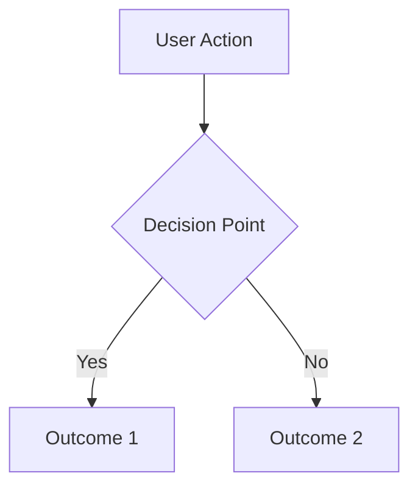

# Feature Specification Template

**Created**: YYYY-MM-DD
**Status**: Draft | In Review | Approved
**Input**: [Original user request or idea]

## Executive Summary
*One paragraph explaining WHY this feature matters and WHAT it does for users*

---

## Feature Overview

### Problem Statement
*What problem are we solving? Why does it matter?*

### Success Metrics
*How will we know if this feature is successful?*
- [ ] Metric 1: [e.g., User can complete task in < 3 clicks]
- [ ] Metric 2: [e.g., 80% of users understand feature without documentation]

---

## 🎯 User Scenarios & Testing

### Primary User Story
As a [user type], I want to [action] so that [benefit].

### Acceptance Scenarios
*Use Given/When/Then format*
1. **Given** [context], **When** [action], **Then** [expected outcome]
2. **Given** [context], **When** [action], **Then** [expected outcome]

### Edge Cases & Error Handling
- What happens when [edge case]?
- How does system handle [error scenario]?
- What if [resource limitation]?

### Out of Scope
*Explicitly list what this feature will NOT do*
- Will not support [X]
- Does not include [Y]

---

## 📋 Functional Requirements

### Core Requirements
*Each must be testable and unambiguous*
- **FR-001**: System MUST [specific behavior]
- **FR-002**: Users MUST be able to [specific action]
- **FR-003**: System MUST [constraint or rule]

### Optional/Future Requirements
*Nice-to-have features for later phases*
- **FR-OPT-001**: System MAY [optional feature]

### Non-Functional Requirements
*Performance, security, usability constraints*
- **NFR-001**: [Performance requirement]
- **NFR-002**: [Security requirement]

---

## 🔧 Key Entities & Concepts
*Only include if feature involves data*

### Domain Model
```
Entity1:
  - property1: description
  - property2: description
  - relationship: how it relates to Entity2

Entity2:
  - property1: description
```

### Business Rules
- Rule 1: [e.g., Albums cannot be nested]
- Rule 2: [e.g., Each photo belongs to exactly one album]

---

## 🔄 User Workflows

### Primary Flow


### Alternative Flows
*Describe variations from the primary flow*

---

## 🔍 Clarifications Needed
*AI marks all assumptions and ambiguities here*

### Format
- **[NEEDS CLARIFICATION #001]**: Specific question
  - **Context**: Why this matters
  - **Impact**: What depends on this decision
  - **Default**: Assumption if not specified
  - **Priority**: 🔴 Critical / 🟡 Important / 🟢 Optional

### Examples
- **[NEEDS CLARIFICATION #001]**: Should deleted items be soft-deleted or hard-deleted?
  - **Context**: Affects data recovery and audit trail
  - **Impact**: Database schema and API design
  - **Default**: Soft-delete for audit compliance
  - **Priority**: 🔴 Critical

### Tracking Summary
| Priority | Count | Status |
|----------|-------|--------|
| 🔴 Critical | 0 | All must be resolved |
| 🟡 Important | 0 | Should be resolved |
| 🟢 Optional | 0 | Can use defaults |
| **Total** | **0** | **0 resolved** |

---

## ✅ Review Checklist

### Completeness
- [ ] All user scenarios have clear acceptance criteria
- [ ] Requirements are numbered and traceable
- [ ] Success metrics are measurable
- [ ] Edge cases are documented
- [ ] No [NEEDS CLARIFICATION] markers remain

### Clarification Completeness
- [ ] All 🔴 critical clarifications resolved
- [ ] Each clarification has clear resolution documented
- [ ] No implicit assumptions remain undocumented
- [ ] Clarifications are numbered and trackable (#001, #002, etc.)
- [ ] Impact of each clarification on requirements is documented
- [ ] Default assumptions are reasonable and documented

### Quality
- [ ] No implementation details (languages, frameworks, APIs)
- [ ] Written for non-technical stakeholders
- [ ] Each requirement is testable
- [ ] Scope is clearly bounded
- [ ] Dependencies identified

### Readiness Gates
- [ ] **Gate 1**: All clarifications resolved � Ready for Planning
- [ ] **Gate 2**: Stakeholder approval � Ready for Development
- [ ] **Gate 3**: Test scenarios complete � Ready for QA

---

## 📝 Decision Log
*Record key decisions made during spec development*

| Date | Decision | Rationale | Made By |
|------|----------|-----------|---------|
| YYYY-MM-DD | Chose approach X over Y | Because of constraint Z | Person |

---

## 📚 References
- Overview: [overview.md](./overview.md)
- Related specs: [link]
- Implementation plan: [plan.md](./plan.md) or [plan-*.md](./plan-*.md)
- Design mockups: [link]
- Market research: [link]